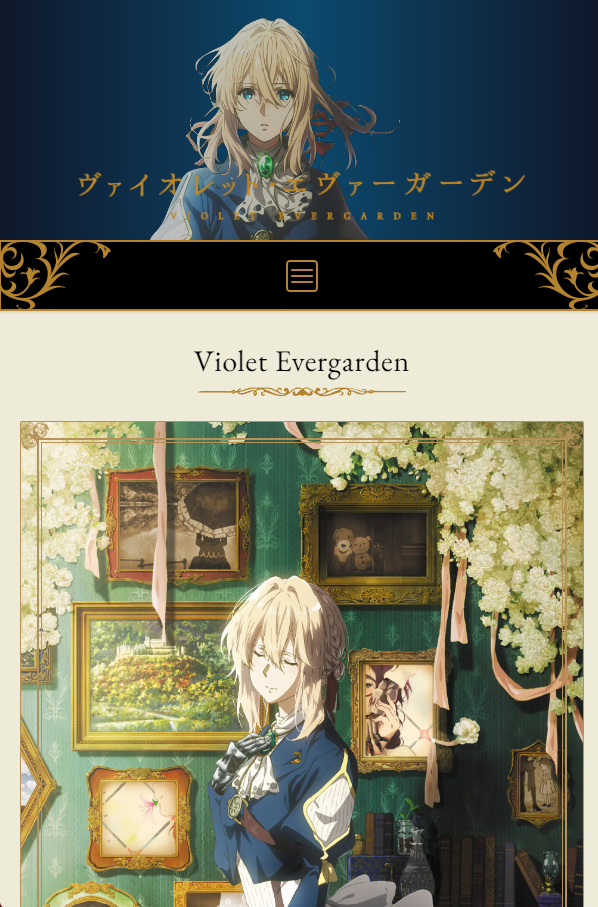

# Proyecto Violet Evergarden con Astro

Este proyecto hace uso de [Astro](https://astro.build "Sitio web de Astro"), un generador de sitios estáticos que genera  únicamente el HTML, CSS y el código JavaScript mínimo necesario al cliente. Esto brinda la flexibilidad de escribir componentes con HTML nativo o emplear frameworks como React, Vue o Svelte en la misma aplicación o la misma pagina, e incluso integrar archivos .md o .mdx, ya que Astro se encarga de renderizar el contenido a una versión estática del sitio.

## Características Destacadas

La aplicación se inspira en el diseño de [Violet Evergarden](https://tv.violet-evergarden.jp/ "Página oficial de Violet Evergarden en Japón"), utilizando TailwindCSS para el css, y una paleta de colores que se basa en los colores originales, sin dejar de ser responsive para aumentar la accesibilidad.

En el futuro, la aplicación tiene como objetivo implementar un sistema de rutas dinámicas que permitirá la creación automática de rutas para cada uno de los personajes de la serie. Este objetivo se alcanzará mediante el uso del archivo `data` y la aplicación de [`getStaticPaths`](https://docs.astro.build/es/reference/api-reference/#getstaticpaths "Documentación oficial de getStaticPaths") de Astro.

## Violet Evergarden
### [Visualiza el sitio](https://paman00violetfanpage.netlify.app/ "Violet Evergarden Fanpage - Paman00")



_(Desplegado en Netlify)_

## Estructura Actual de Carpetas del Proyecto
```text
├───public
│   └───favicons
└───src
    ├───components
    │   └───navbar
    ├───data
    ├───icons
    ├───images
    ├───layouts
    ├───pages
    │   └───see-more
    └───types
```

## Instalación

Para instalar el proyecto, sigue estos pasos:

1. Clona el repositorio en tu máquina local con el comando `git clone https://github.com/Paman00/violet-evergarden-fanpage`.

2. Navega al directorio del proyecto con el comando `cd violet-evergarden-fanpage`.

3. Instala las dependencias utilizando el comando `npm install`

¡Listo!

## Ejecución en Modo Desarrollo

Para ejecutar el proyecto en modo desarrollo, utiliza el comando `npm run dev`. Esto iniciará un servidor de desarrollo en `http://localhost:4321` de forma predeterminada.

## Acerca de Mí
Descubre más sobre mí en la biografía de la página **about-me** de la aplicación. [Acerca de mí en Violet Evergarden](https://paman00violetfanpage.netlify.app/about-me/ "Violet Evergarden Fanpage - Paman00")
```